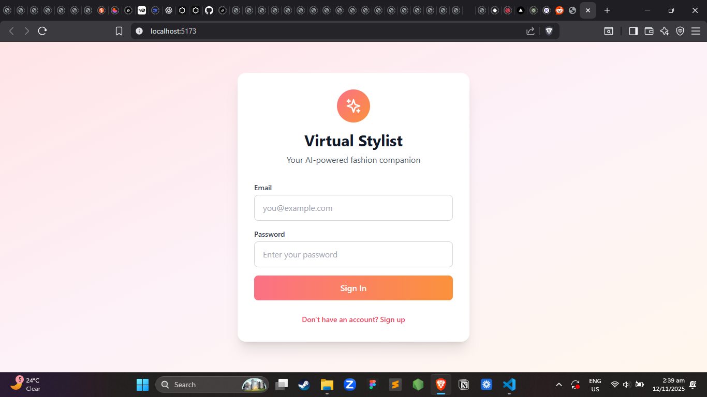
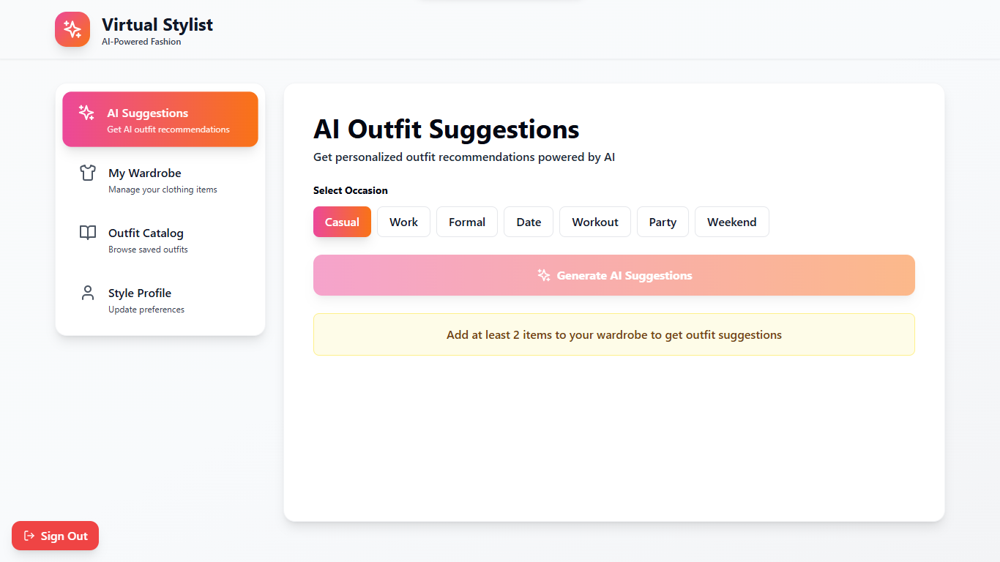
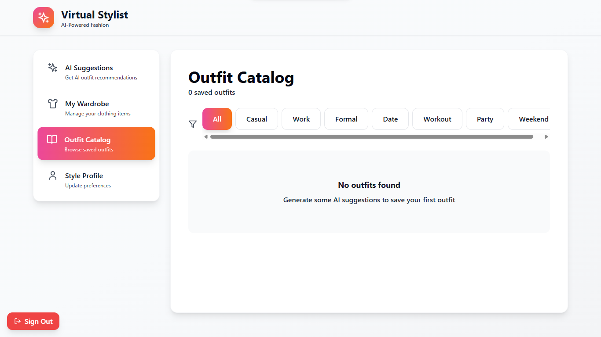
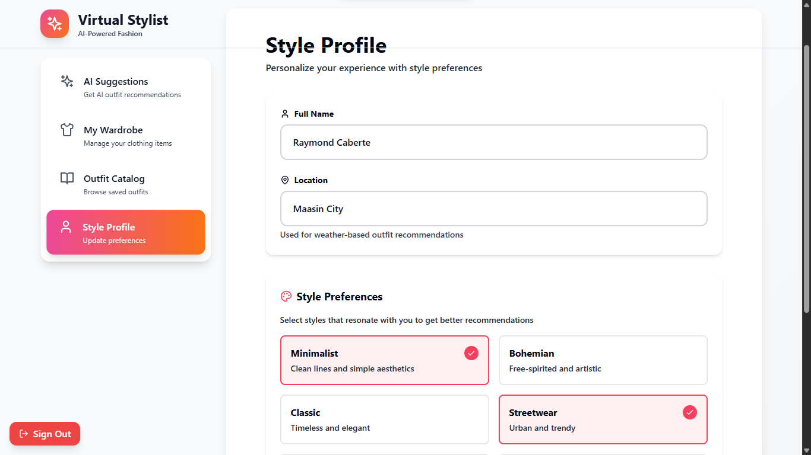

# 🌟 AI-Powered Virtual Stylist

Your personal intelligent fashion companion — suggesting outfits based on wardrobe, weather, and style preferences.







---

## 📌 Overview

AI-Powered Virtual Stylist is a modern web application that helps users automatically generate stylish, personalized outfit recommendations. By combining user-uploaded wardrobe items, real-time weather data, and AI-driven logic, the app provides smart styling suggestions for any occasion.

This project is built with TypeScript, React, Vite, Tailwind CSS, and integrates a flexible architecture suitable for AI, RLS-secured databases, and future mobile expansion.

---

## ✨ Features

👗 Smart Outfit Generation
• Automatically recommends outfits based on weather, occasions, and user preferences
• Uses tag-based and seasonal logic for matching

🧥 Wardrobe Management
• Upload and organize clothing items
• Classify garments by type, color, style, and season

🧬 Personalized Style Profiles
• Capture user tastes (minimalist, darkwear, streetwear, classic, chic, etc.)
• Improve suggestions over time

☁️ Weather-Aware Styling
• Adjusts outfit choices depending on temperature and weather conditions

⭐ Favorites & History
• Save generated outfits
• View outfit history
• Provide feedback for future improvements

---

## 🧱 Tech Stack

Frontend
• React + TypeScript
• Vite for lightning-fast development
• Tailwind CSS for modern, responsive UI
• Lucide Icons

Backend (Optional / Future Integration)
• Node.js, Express
• Supabase or PostgreSQL for relational data
• Row-Level Security (RLS) policies

AI (Optional Integration)
• OpenAI / TensorFlow.js
• Rule-based outfit generator

---

## 📂 Project Structure

    AI-Powered-Virtual-Stylist/

```bash
├─ .env
├─ .gitignore
├─ index.html
├─ package.json
├─ tailwind.config.js
├─ tsconfig.json
├─ vite.config.ts
├─ src/
│ ├─ components/
│ ├─ assets/
│ ├─ hooks/
│ ├─ pages/
│ ├─ styles/
│ └─ App.tsx
└─ node_modules/
```

---

## 🚀 Getting Started

1. 🔧 Installation

```bash
npm install
```

2. ▶️ Run Development Server

```bash
npm run dev
```

3. 🏗️ Build for Production

```bash
npm run build
```

---

## 🔐 Setting Up Supabase Environment Variables

To connect the Virtual Stylist app to your Supabase backend, you need two environment variables:

```bash
VITE_SUPABASE_URL=
VITE_SUPABASE_ANON_KEY=
```

Follow these steps to obtain them:

### ✅ Step 1: Go to Supabase

Visit the Supabase website:
👉 https://supabase.com

Log in to your account or create one if needed.

### ✅ Step 2: Open Your Project

1. From the dashboard, select your project.
2. Navigate to Project Settings (bottom-left sidebar).

### ✅ Step 3: Find API Credentials

1. In the settings menu, click API.
2. Under Project API Keys, you will find:
   • Project URL → This is your VITE_SUPABASE_URL
   • anon public key → This is your VITE_SUPABASE_ANON_KEY

### ✅ Step 4: Add Them to Your .env File

Create or edit the .env file at the root of your project:

```bash
VITE_SUPABASE_URL="https://your-project-id.supabase.co"
VITE_SUPABASE_ANON_KEY="your-anon-public-key"
```

---

## 🎨 User Interface

• Clean, minimalist Tailwind-styled UI
• Fully responsive
• Smooth transitions
• Accessible color system

---

## 🛡️ Security

• Designed to support RLS-secured database tables
• User-isolated wardrobe and outfit data
• Secure token-based authentication

---

## 📘 Future Enhancements

• AI-generated clothing recommendations
• Outfit collage image builder
• Mobile app (React Native)
• Smart wardrobe scanning via computer vision

---

## 🤝 Contributing

Pull requests are welcome!
Feel free to suggest improvements, fix bugs, or expand features.

---

## License

GNU General Public License v3.0 © 2025
